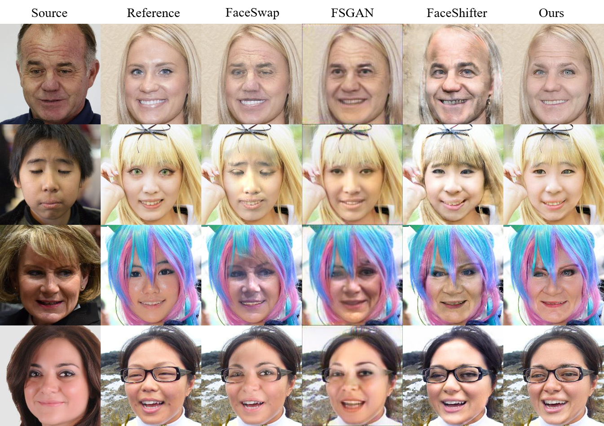

# deepfake-models
List some popular DeepFake models e.g. DeepFake, FaceSwap-MarekKowal, IPGAN, FaceShifter, FaceSwap-Nirkin, FSGAN, SimSwap etc.

In order to protect the authors' intellectual property rights, I will **not** upload their codes, pre-trained models or anything else. If necessary, please click the `code` link switching to their GitHub page to download.

The "ours" column refers to our unpublished work. And here are some faceswapped [videos](https://mitchellx.github.io/#video).

  

### [Deepfakes](https://github.com/MitchellX/deepfake-models/blob/main/deepfake.md)

- **Deepfake is the most popular face swapping application on GitHub.**  [[code]](https://github.com/deepfakes/faceswap) | [[forum]](https://forum.faceswap.dev/)
    
    However, it is a subject-aware model, which means you need train a unique model for a specific person. For example, you should trained a CageNet for Nicolas Cage and a SwiftNet for Taylor Swift separately, then swapped the faces between these two persons.
    
    
    

### [FSGAN](https://github.com/MitchellX/deepfake-models/blob/main/FSGAN.md)

- **FSGAN: Subject Agnostic Face Swapping and Reenactment.** *ICCV 2019* [[paper]](https://arxiv.org/pdf/1908.05932.pdf) | [[code]](https://github.com/YuvalNirkin/fsgan) |  [[homepage-Nirkin]](https://nirkin.com/fsgan/) | [[homepage-Hassner]](https://talhassner.github.io/home/publication/2019_ICCV_2)

     *Yuval Nirkin, Yosi Keller, Tal Hassner.*
     
     Unlike previous work, FSGAN is subject agnostic and can be applied to pairs of faces without requiring training on those faces. Besides, they introduced new loss functions for better performance.
     
  
       
     
### [FaceShifter](#faceshifter)

- **FaceShifter: Towards High Fidelity And Occlusion Aware Face Swapping.**  *CVPR 2020*  [[paper]](https://arxiv.org/pdf/1912.13457.pdf) | [[homepage]](https://lingzhili.com/)

     *Lingzhi Li, Jianmin Bao, Hao Yang, Dong Chen, Fang Wen.*
     
     Faceshifter is a novel two-stage framework for high fidelity and occlusion aware face-swapping. It's able to generate high fidelity identity preserving face swap results and, in comparison to previous methods, deal with facial occlusions using a second synthesis stage consisting of a Heuristic Error Acknowledging Refinement Network (HEAR-Net). 
     - in the first stage, generate the swapped face in high-fidelity by exploiting and integrating the target attributes thoroughly and adaptively.
     - in the second stage, propose a novel Heuristic Error Acknowledging Refinement Network (HEAR-Net) to address the challenging facial occlusions.
     

### [simSwap](#simswap)

- **SimSwap: An Efficient Framework For High Fidelity Face Swapping.**  *ACM MM 2020*  [[paper]](https://dl.acm.org/doi/10.1145/3394171.3413630) 

     *Renwang Chen, Xuanhong Chen, Bingbing Ni1, and Yanhao Ge.*
     
     Simswap propose the *Weak Feature Matching Loss* which efficiently helps their framework to preserve the facial attributes in an implicit way. Experimental results show that they can preserve attributes better than previous state-of-the-art methods.
     
       

### [IPGAN](#IPGAN)

- **Towards Open-Set Identity Preserving Face Synthesis.** *CVPR 2018* [[paper]](https://jianminbao.github.io/IP-GAN/IP-GAN.pdf) | [[homepage]](https://jianminbao.github.io/)

     *Jianmin Bao, Dong Chen, Fang Wen, Houqiang Li, and Gang Hua.*
     
     propose an Open-Set Identity Preserving Generative Adversarial Network framework for disentangling the identity and attributes of faces, synthesizing faces from the recombined identity and attributes.

### [FaceSwap-MarekKowalski](#faceswap)

- **FaceSwap is an app that have originally created as an exercise for students in "Mathematics in Multimedia".**  [[code]](https://github.com/MarekKowalski/FaceSwap) | [[homepage]](http://home.elka.pw.edu.pl/~mkowals6/doku.php)

    This is a 3D-based method. It uses face alignment, 3D face template, Gauss-Newton optimization, and image blending to swap the face of a person seen by the camera with a face of a person in a provided image.

     
     
### [FaceSwap-Nirkin et al.](https://github.com/MitchellX/deepfake-models/blob/main/faceswapNirkin.md)

- **On face segmentation, face swapping, and face perception..**  *F&G 2018* [[paper]](https://arxiv.org/pdf/1704.06729.pdf) | [[code]](https://github.com/YuvalNirkin/face_swap) [[homepage]](https://nirkin.com/face-swap-project/)

     *Yuval Nirkin, Iacopo Masi, Anh Tran Tuan, Tal Hassner, and Gerard Medioni.*
     
     - Instead of tailoring systems for face segmentation, as others previously proposed, this work shows that a standard fully convolutional network (FCN) can achieve remarkably fast and accurate segmentation, provided that it is trained on a rich enough example set.
     - use special image segmentation to enable robust face-swapping under unprecedented conditions.
     - fit 3D face shapes
     - measure the effect of intra- and inter-subject face swapping on recognition. Generally speaking, intra-subject swapped faces remain as recognizable as their sources, while better face-swapping produces less recognizable inter-subject results.
    

